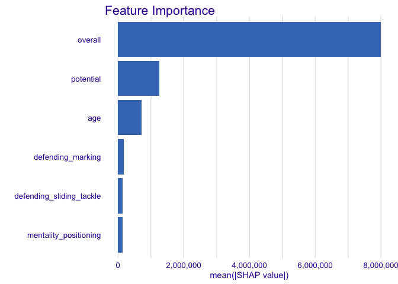
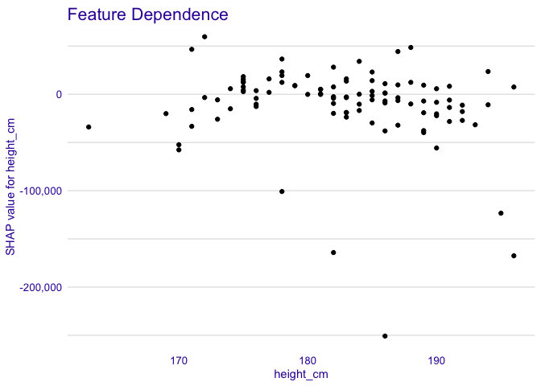
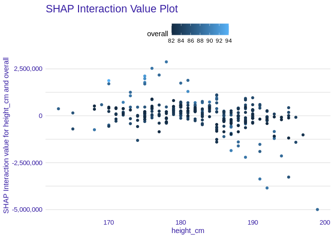

<!-- README.md is generated from README.Rmd. Please edit that file -->

# treeshap

<!-- badges: start -->

<!-- badges: end -->

In the era of complicated classifiers conquering their market, sometimes
even the authors of algorithms do not know the exact manner of building
a tree ensemble model. The difficulties in models’ structures are one of
the reasons why most users use them simply like black-boxes. But, how
can they know whether the prediction made by the model is reasonable?
`treeshap` is an efficient answer for this question. Due to implementing
an optimised alghoritm for tree ensemble models, it calculates the SHAP
values in polynomial (instead of exponential) time. This metric is the
only possible way to measure the influence of every feature regardless
of the permutation of features. Moreover, `treeshap` package shares a
bunch of functions to unify the structure of a model. Currently it
supports models produced with `XGBoost`, `LightGBM`, `GBM`, `Catboost`,
`ranger` and `randomForest`.

## Installation

You can install the released version of treeshap using package
`devtools` with:

``` r
devtools::install_github('ModelOriented/treeshap')
```

## Example

First of all, let’s focus on an example how to represent a `xgboost`
model as a unified model object:

``` r
library(treeshap)
library(xgboost)
data <- fifa20$data[colnames(fifa20$data) != 'work_rate']
target <- fifa20$target
param <- list(objective = "reg:squarederror", max_depth = 6)
xgb_model <- xgboost::xgboost(as.matrix(data), params = param, label = target, nrounds = 200, verbose = 0)
unified <- xgboost.unify(xgb_model, data)
head(unified$model)
#>   Tree Node   Feature Decision.type Split Yes No Missing Prediction Cover
#> 1    0    0   overall            <=  81.5   2  3       2         NA 18278
#> 2    0    1   overall            <=  73.5   4  5       4         NA 17949
#> 3    0    2   overall            <=  84.5   6  7       6         NA   329
#> 4    0    3   overall            <=  69.5   8  9       8         NA 15628
#> 5    0    4 potential            <=  79.5  10 11      10         NA  2321
#> 6    0    5 potential            <=  83.5  12 13      12         NA   221
```

Having the object of unified structure, it is a piece of cake to produce
shap values of for a specific observations. The `treeshap()` function
requires passing two data arguments: one representing an ensemble model
unified representation and one with the observations about which we want
to get the explanations. Obviously, the latter one should contain the
same columns as data used during building the model.

``` r
treeshap1 <- treeshap(unified,  data[700:800, ], verbose = 0)
treeshap1$shaps[1:3, 1:6]
#>            age height_cm weight_kg overall potential international_reputation
#> 700   297154.4  5769.186 12136.316 8739757  212428.8               -50855.738
#> 701 -2550066.6 16011.136  3134.526 6525123  244814.2                22784.430
#> 702   300830.3 -9023.299 15374.550 8585145  479118.8                 2374.351
```

We can also compute SHAP values for interactions. As an example we will
calculate them for a model built with simpler (only 5 columns) data.

``` r
data2 <- fifa20$data[, 1:5]
xgb_model2 <- xgboost::xgboost(as.matrix(data2), params = param, label = target, nrounds = 200, verbose = 0)
unified2 <- xgboost.unify(xgb_model2, data2)

treeshap_interactions <- treeshap(unified2,  data2[1:300, ], interactions = TRUE, verbose = 0)
treeshap_interactions$interactions[, , 1:2]
#> , , 1
#> 
#>                   age  height_cm  weight_kg     overall  potential
#> age       -1886241.70   -3984.09  -96765.97   -47245.92  1034657.6
#> height_cm    -3984.09 -628797.41  -35476.11  1871689.75   685472.2
#> weight_kg   -96765.97  -35476.11 -983162.25  2546930.16  1559453.5
#> overall     -47245.92 1871689.75 2546930.16 55289985.16 12683135.3
#> potential  1034657.61  685472.23 1559453.46 12683135.27   868268.7
#> 
#> , , 2
#> 
#>                  age  height_cm  weight_kg    overall  potential
#> age       -2349987.9  306165.41  120483.91 -9871270.0  960198.02
#> height_cm   306165.4  -78810.31  -48271.61  -991020.7  -44632.74
#> weight_kg   120483.9  -48271.61  -21657.14  -615688.2 -380810.70
#> overall   -9871270.0 -991020.68 -615688.21 57384425.2 9603937.05
#> potential   960198.0  -44632.74 -380810.70  9603937.1 2994190.74
```

## Plotting results

The package currently provides 4 plotting functions that can be used:

### Feature Contribution (Break-Down)

On this plot we can see how features contribute into the prediction for
a single observation. It is similar to the Break Down plot from
[iBreakDown](https://github.com/ModelOriented/iBreakDown) package, which
uses different method to approximate SHAP
values.

``` r
plot_contribution(treeshap1, obs = 1, min_max = c(0, 16000000))
```


### Feature Importance

This plot shows us average absolute impact of features on the prediction
of the
model.

``` r
plot_feature_importance(treeshap1, max_vars = 6)
```



### Feature Dependence

Using this plot we can see, how a single feature contributes into the
prediction depending on its
value.

``` r
plot_feature_dependence(treeshap1, "height_cm")
```



### Interaction Plot

Simple plot to visualise an SHAP Interaction value of two features
depending on their values.

``` r
plot_interaction(treeshap_interactions, "height_cm", "overall")
```



## How to use the unifying functions?

Even though the objects produced by the functions from `.unify()` family
(`xgboost.unify()`, `lightgbm.unify()`, `gbm.unify()`,
`catboost.unify()`, `randomForest.unify()`, `ranger.unify()`) are
identical when it comes to the structure, due to different possibilities
of saving and representing the trees among the packages, the usage of
functions is slightly different. As an argument, they all take an object
of appropriate model and dataset used to train the model. One of them,
`catboost.unify()` requires also a transformed dataset used for training
the model - an object of class `catboost.Pool`.

#### 1\. GBM

An argument of `gbm.unify()` should be of `gbm` class - a gradient
boosting model.

``` r
library(gbm)
library(treeshap)
x <- fifa20$data[colnames(fifa20$data) != 'work_rate']
x['value_eur'] <- fifa20$target
gbm_model <- gbm::gbm(
  formula = value_eur ~ .,
  data = x,
  distribution = "laplace",
  n.trees = 200,
  cv.folds = 2,
  interaction.depth = 2
)
unified_gbm <- gbm.unify(gbm_model, x)
```

#### 2\. Catboost

For representing correct names of features that are regarding during
splitting observations into sets, `catboost.unify()` requires passing
two arguments:

``` r
library(treeshap)
library(catboost)
data <- fifa20$data[colnames(fifa20$data) != 'work_rate']
label <- fifa20$target
dt.pool <- catboost::catboost.load_pool(data = as.data.frame(lapply(data, as.numeric)), label = label)
cat_model <- catboost::catboost.train(
            dt.pool,
            params = list(loss_function = 'RMSE', iterations = 100,
                          logging_level = 'Silent', allow_writing_files = FALSE))
unified_catboost <- catboost.unify(cat_model, dt.pool, data)
```

## Setting reference dataset

Dataset used as a reference for calculating SHAP values is stored in
unified model representation object. It can be set any ime using
`set_reference_dataset`
function.

``` r
unified_catboost2 <- set_reference_dataset(unified_catboost, data[c(1000:2000), ])
```

## Other functionalities

Package also implements `predict` function for calculating model’s
predictions using unified representation.

## How fast does it work?

Complexity of TreeSHAP is `O(TLD^2)`, where `T` is number of trees, `L`
is number of leaves in a tree and `D` is depth of a tree.

Our implementation works in speed comparable to original Lundberg’s
Python package `shap` implementation using C and Python.

In the following example our TreeSHAP implementation explains 300
observations on a model consisting of 200 trees of max depth = 6 in 1
second (on my almost 10 years old laptop with Intel i5-2520M).

``` r
microbenchmark::microbenchmark(
  treeshap = treeshap(unified,  data[1:300, ]), # using model and dataset from the example
  times = 5
)
#> Unit: seconds
#>      expr      min       lq     mean   median       uq      max neval
#>  treeshap 1.027707 1.032991 1.032529 1.033427 1.034062 1.034459     5
```

Complexity of SHAP interaction values computation is `O(MTLD^2)`, where
`M` is number of variables in explained dataset, `T` is number of trees,
`L` is number of leaves in a tree and `D` is depth of a tree.

SHAP Interaction values for 5 variables, model consisting of 200 trees
of max depth = 6 and 300 observations can be computed in less than 7
seconds.

``` r
microbenchmark::microbenchmark(
  treeshap = treeshap(unified2, data2[1:300, ], interactions = TRUE), # using model and dataset from the example
  times = 5
)
#> Unit: seconds
#>      expr      min      lq     mean  median       uq      max neval
#>  treeshap 6.700848 6.70164 6.712134 6.70711 6.719313 6.731761     5
```

## References

  - Scott M. Lundberg, Gabriel G. Erion, Su-In Lee, “Consistent
    Individualized Feature Attribution for Tree Ensembles”, University
    of Washington
